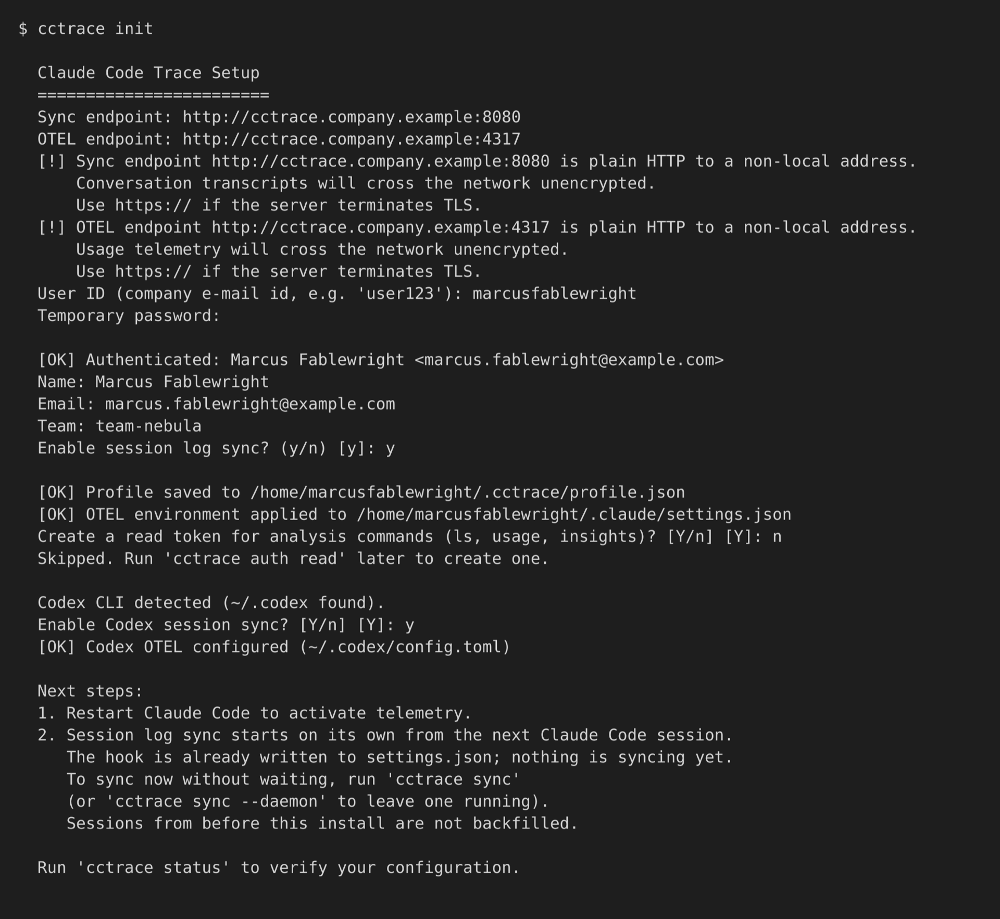
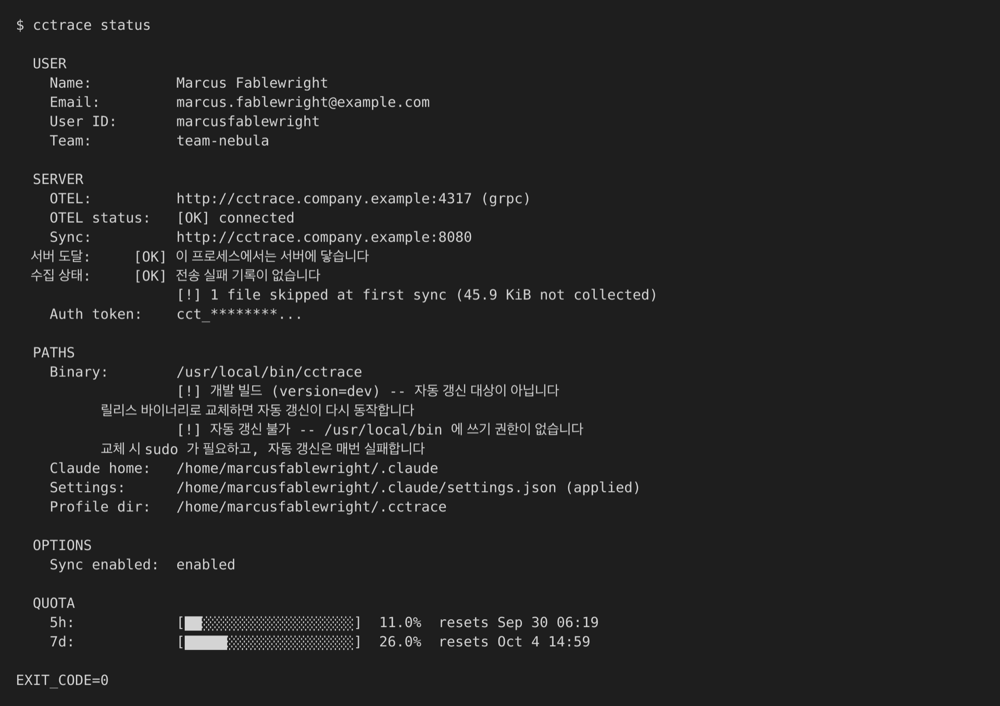

# 연결

`cctrace init`으로 클라이언트를 서버에 연결하고 에이전트를 재시작한 뒤 `cctrace status`로 수집을 확인하는 절차.

## 시작 전 확인

- 서버 실행 중, 주소 두 개 확보: sync 엔드포인트(HTTP, 기본 8080 포트)와 OTEL 엔드포인트(gRPC, 기본 4317 포트). [포트](../reference/ports.md) 참고
- 관리자가 계정 생성 완료. [사용자](../dashboard/users.md) 참고
- 대시보드에 한 번 로그인해 임시 비밀번호 변경 완료. 임시 비밀번호가 남아 있으면 서버가 CLI 인증을 거부하고 `init`이 `please change your password on the dashboard before authenticating`으로 중단
- 계정에 팀 지정 완료. `init`은 이름·이메일·팀을 서버에서 받아오며 하나라도 비면 검증 실패

## init 실행

```bash
cctrace init
```

`init`이 묻는 항목(순서대로):

| 프롬프트 | 입력값 |
|---|---|
| `Sync endpoint` | 서버의 HTTP 주소. 예: `https://cctrace.company.example`. 스킴 없는 `host:port`에는 `http://` 자동 부착 |
| `OTEL endpoint` | 서버의 OTLP gRPC 주소. 예: `http://cctrace.company.example:4317` |
| `User ID` | cctrace 사용자 ID. 이메일을 입력하면 `@` 뒤는 제거 |
| `Temporary password` | 현재 대시보드 비밀번호(첫 로그인 후 바꾼 것). 입력 숨김, 3회 시도 |
| `Enable session log sync? (y/n)` | `y`(기본)는 동기화 데몬을 띄우는 Claude Code 훅 설치. `n`은 텔레메트리만 켜고 세션 로그는 끔 |
| `Create a read token for analysis commands` | 개발 중인 조회 명령 전용. `n`으로 충분 |

{ loading=lazy }

빈 엔드포인트는 받지 않는다. 루프백·사설 대역 밖으로 가는 평문 `http://` 엔드포인트면 대화 기록이나 텔레메트리가 암호화 없이 네트워크를 지난다는 경고를 출력한다. 거부하지는 않는다.

인증 뒤에는 다른 에이전트를 찾고 발견한 것마다 묻는다.

- `~/.codex` 존재: Codex 세션 동기화 활성화 여부. [Codex CLI](../agents/codex.md) 참고
- `~/.gjc` 또는 `~/.omo` 존재: GJC·OMO 세션 동기화 활성화 여부. [GJC와 OMO](../agents/gjc-omo.md) 참고

마지막으로 `~/.claude-work` 같은 다른 Claude 홈을 찾으면 각각 프로필 생성을 제안한다. [프로필](profiles.md) 참고.

## init이 쓰는 파일

| 파일 | 변경 내용 |
|---|---|
| `~/.cctrace/profile.json` | 프로필: 엔드포인트, 사용자 정보, 업로드 토큰, 옵션. 권한 0600 |
| `~/.claude/settings.json` | `env` 아래 OTEL 환경변수, `SessionStart`·`SessionEnd` 훅(동기화 활성 시), `cctrace` 스탬프 객체. 다른 키는 유지. [Claude Code](../agents/claude-code.md) 참고 |
| `~/.codex/config.toml` | Codex 활성화 시에만: `[otel]` 섹션 |

이름 있는 프로필(`cctrace init --profile work`)은 `~/.cctrace/profiles/work/profile.json`에 저장된다. 어느 Claude 설정 디렉터리에 속하는지 한 가지를 더 묻는다.

## 에이전트 재시작

Claude Code는 세션 시작 시점에 환경변수와 훅을 읽으므로 `init`을 실행한 그 세션은 수집되지 않는다. 종료 후 새 세션을 시작한다.

다음 세션부터:

- Claude Code가 OTEL 메트릭과 로그를 OTEL 엔드포인트로 전송
- `SessionStart` 훅이 세션 로그를 올리는 [동기화 데몬](sync.md) 시작

첫 동기화 시점에 이미 디스크에 있던 내용(이전 세션 포함)은 올라가지 않는다. 새 세션을 기다리지 않고 데몬을 바로 띄우려면 `cctrace sync --daemon` 실행.

## 연결 확인

```bash
cctrace status
```

`status` 출력 구획:

| 구획 | 내용 |
|---|---|
| `USER` | 이름, 이메일, 사용자 ID, 팀 |
| `SERVER` | OTEL 엔드포인트와 응답 여부, sync 엔드포인트, `서버 도달`(이 `status` 프로세스의 서버 도달 여부)과 `수집 상태`(동기화 데몬의 업로드 성공 여부), 업로드 토큰 앞부분 |
| `PATHS` | 바이너리 위치, Claude 홈, Claude 설정 파일 경로와 존재 여부, 프로필 디렉터리 |
| `OPTIONS` | 세션 로그 동기화 활성 여부, 켜진 가림(redaction) 옵션 |
| `NAMED PROFILES` | `--profile` 없이 실행 시 이름 있는 프로필 목록 |
| `QUOTA` | 로컬 Claude Code 로그인으로 Anthropic 사용량 API에서 조회한 Claude 요금제 사용량 구간. Claude Code에 로그인하지 않은 머신에서는 표시 불가, 수집과는 무관 |

{ loading=lazy }

종료 코드: 프로필 없음 1, OTEL 엔드포인트 도달 불가 2. 이름 있는 프로필은 `cctrace status --profile work`.

## init 재실행

프로필이 이미 있으면 처음부터 다시 하는 대신 메뉴를 띄운다.

```text
  Profile already exists: ...
    1) Patch Codex integration only (keep existing settings)
    2) Re-apply hooks and OTEL env for this binary (keep existing settings)
    3) Full re-setup (re-enter endpoint, password)
    4) Cancel
```

Codex 항목은 `~/.codex`가 있을 때만 표시된다. 없으면 나머지 번호가 하나씩 당겨진다. Enter는 첫 항목 선택. 전체 재설정은 프로필을 먼저 백업하고 실패 시 복원한다.

## 훅과 환경변수 다시 적용

```bash
cctrace env apply
```

`env apply`는 저장된 프로필을 기준으로 Claude 설정 파일(`~/.claude/settings.json` 또는 프로필의 Claude 홈)의 OTEL 변수와 훅을 다시 쓴다. 훅에는 이 명령을 실행한 바이너리 경로가 들어간다. 바이너리를 옮기거나 교체한 뒤에 사용.

| 플래그 | 효과 |
|---|---|
| `--profile <name>` | 해당 이름 있는 프로필만 적용 |
| `--all` | 기본 프로필과 모든 이름 있는 프로필에 적용 |

## 설정 조회와 변경 { #view-and-change-settings }

```bash
cctrace config list
cctrace config get server.sync_endpoint
cctrace config set options.codex_sync_enabled true
```

하위 명령 없는 `cctrace config`는 `config list`와 동일. 목록에서 토큰은 가려서 표시. 이름 있는 프로필은 `--profile <name>` 추가.

`config set`은 프로필을 저장한 뒤 Claude 설정 파일을 다시 쓴다. 엔드포인트·사용자 정보·옵션 변경은 다음 Claude Code 세션부터 반영. 불리언 값은 `true` 또는 `false`.

```text
user.id, user.name, user.email, user.team
server.endpoint                     OTEL 엔드포인트
server.sync_endpoint                sync(HTTP) 엔드포인트
server.protocol                     Claude Code의 OTLP 프로토콜 (기본 grpc)
server.auth_token                   init이 발급받은 업로드 토큰
options.sync_enabled                세션 로그 동기화 켜기/끄기
options.redact_user_prompts         업로드 전 대화 텍스트(프롬프트와 응답) 대체
options.redact_tool_details         업로드 전 도구 인자와 결과 제거
options.codex_sync_enabled          Codex CLI 세션 수집
options.gjc_sync_enabled            GJC 세션 수집
options.omo_sync_enabled            OMO 세션 수집
options.metrics_export_interval     OTEL 메트릭 전송 주기, ms (기본 60000)
options.logs_export_interval        OTEL 로그 전송 주기, ms (기본 5000)
options.collect_repository_prefixes 수집할 저장소 ID 접두어(host/org/repo), 쉼표 구분. 비우면 전체 수집
options.codex_dirs                  추가로 스캔할 Codex 홈, 쉼표 구분
options.gjc_dirs                    추가로 스캔할 GJC 홈, 쉼표 구분
options.omo_dirs                    추가로 스캔할 OMO 홈, 쉼표 구분
```

`*_dirs` 키는 절대 경로 또는 `~`로 시작하는 경로만 받는다. 각 디렉터리는 이미 존재해야 한다. 빈 값은 목록 초기화.

`config list`에는 변경이 진행 중이라 이 문서에서 다루지 않는 영역의 키도 함께 나온다.
