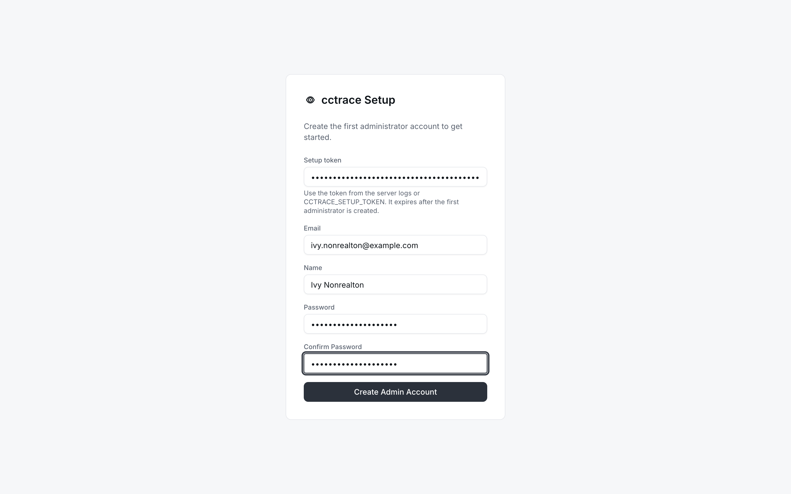
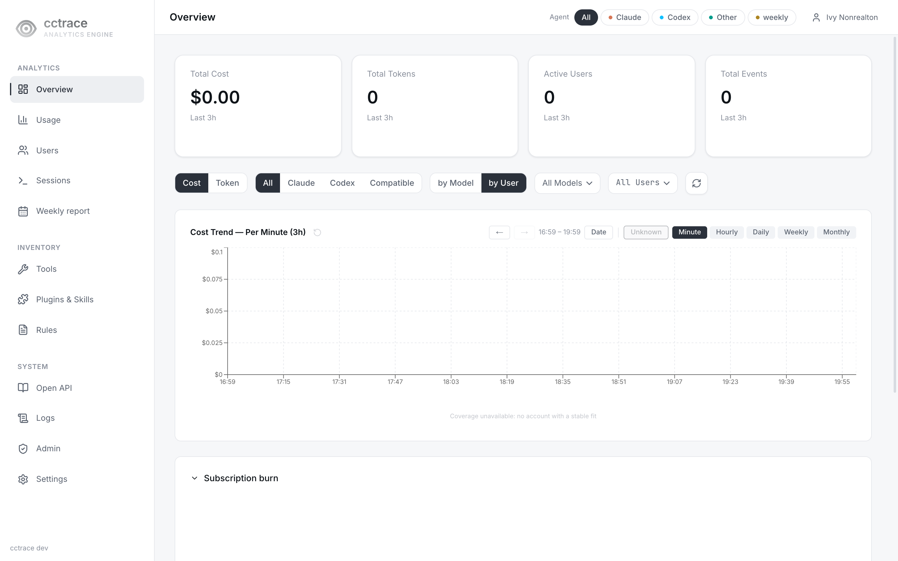
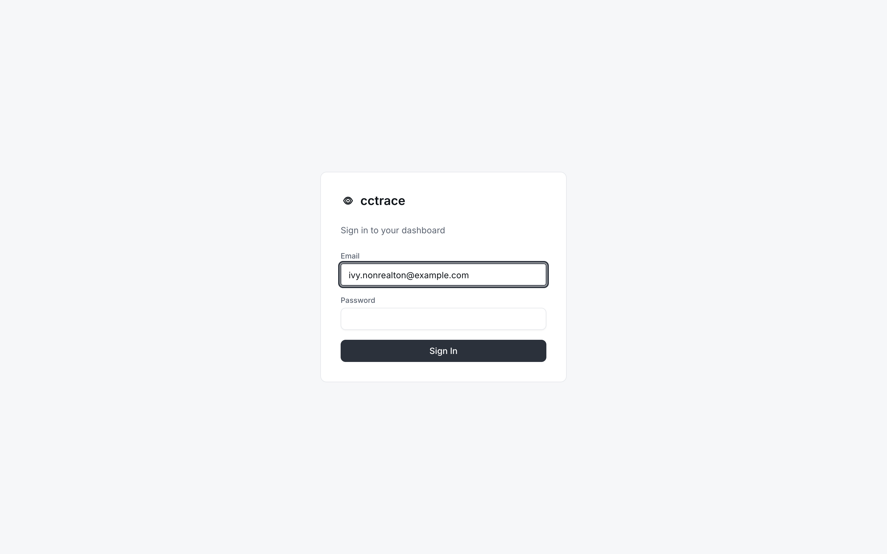

# 첫 관리자

셋업 토큰으로 `/setup`에서 첫 관리자 계정을 만들고 `/login`으로 로그인하는 절차.

## 셋업 토큰 확보 {#get-the-setup-token}

`/setup`은 셋업 토큰이 있는 요청만 받는다. 토큰은 서버가 시작할 때 정해진다.

| 시작 시점 상태 | 토큰 |
|---|---|
| 대시보드 사용자 없음, `CCTRACE_SETUP_TOKEN` 설정됨 | `CCTRACE_SETUP_TOKEN` 값. 로그에 출력 안 됨 |
| 대시보드 사용자 없음, `CCTRACE_SETUP_TOKEN` 비어 있음 | 무작위 토큰을 서버 로그에 한 번 출력. 첫 관리자가 생길 때까지 시작할 때마다 새로 생성 |
| 사용자가 이미 있음 | 없음. 셋업 비활성 |

생성된 토큰이 찍히는 줄:

```text
[cctraced] initial administrator setup token: <token>
```

{ loading=lazy }

[서버 설치](../server/install.md)의 Docker Compose 스택에서는 다음으로 확인.

```console
$ docker compose --env-file deploy/.env -f deploy/docker-compose.yml logs cctraced
```

시작할 때 사용자 수를 세지 못하면 서버는 `[cctraced] setup disabled: user count failed: ...`를 남기고 셋업을 거부한다. 데이터베이스에 접속되는 상태에서 `cctraced`를 다시 시작하면 된다.

## 계정 생성 {#create-the-account}

1. 대시보드 열기: 서버 호스트에서는 `http://127.0.0.1:8080`, 프록시를 쓰면 `https://cctrace.company.example` 같은 주소. 사용자가 없으면 대시보드가 `/setup`으로 보냄
2. 양식 입력

    | 필드 | 값 |
    |---|---|
    | Setup token | 앞 절의 토큰 |
    | Email | 로그인 주소. 예: `alice@example.com` |
    | Name | 표시 이름 |
    | Password, Confirm Password | 8자 이상 |

    { loading=lazy }

3. **Create Admin Account** 선택. `admin` 역할 계정 생성 후 로그인 상태로 대시보드 열림

    { loading=lazy }

사용자가 한 명이라도 생기면 `/setup`은 `/login`으로 넘어가고 이후 셋업 요청에는 서버가 `setup already completed`로 응답한다.

### 셋업 실패 시 {#if-setup-fails}

| 메시지 | 원인 |
|---|---|
| `Setup token is invalid or setup is disabled. ...` | 서버가 HTTP 403으로 거부. 대개 토큰이 틀렸거나 이전 시작 때 생성된 토큰. 최신 로그의 토큰 사용 |
| `setup already completed` | 사용자가 이미 있음. `/login`에서 로그인 |

이 페이지는 브라우저 출처 검사에 걸린 경우를 포함해 모든 HTTP 403에 토큰 메시지를 보여 준다. 토큰이 맞다면 서버 로그에서 `[api] CSRF rejected`를 찾는다. 출처 검사는 페이지의 출처와 서버가 받은 `Host`를 비교하므로 `Host`를 바꾸는 프록시가 있으면 걸린다. [서버 설정](../server/configuration.md)의 `CCTRACE_ALLOWED_ORIGINS` 참고.

## 로그인 {#sign-in}

`/login`에서 이메일과 비밀번호를 넣고 **Sign In** 선택.

{ loading=lazy }

| 메시지 | 원인 |
|---|---|
| `invalid credentials` | 없는 이메일 또는 틀린 비밀번호 |
| `account is disabled` | 관리자가 계정을 비활성화함. [사용자](users.md) 참고 |

로그인하면 15분짜리 액세스 쿠키와 7일짜리 리프레시 쿠키가 설정된다. 대시보드는 리프레시 쿠키로 액세스 쿠키를 갱신하지만 리프레시 쿠키 자체는 갱신되지 않으므로, 마지막 로그인 7일 뒤에는 다시 로그인해야 한다.

## 다음 단계 {#next}

`/setup`으로 만든 계정은 팀과 cctrace 사용자 ID가 비어 있어 그대로는 `cctrace init`을 통과하지 못한다. 본인 머신에서 이 계정으로 데이터를 보내려면 **Users > Management**에서 그 행의 메뉴 → **Edit**으로 **Team**과 **cctrace User ID**를 채운다. 다른 사람과 같은 방식으로 본인용 계정을 따로 추가해도 된다: [사용자](users.md).
