# 페이지

대시보드 각 페이지가 보여 주는 내용과 사용 가능한 역할.

모든 페이지는 로그인이 필요하다. `user` 계정은 본인 세션만 보지만 집계는 로그인한 모든 사용자가 공유한다. [개인정보](../reference/privacy.md#who-can-see-what) 참고.

!!! note
    이 페이지의 스크린샷은 데모 서버 위의 가상 5인 팀(Ivy, Marcus, Priya, Tomás, Yuki)이며 실제 운영 데이터가 아니다.

## 헤더 {#header}

모든 페이지 위의 헤더에 에이전트 선택기와 계정 선택기가 있다. 이를 지원하는 페이지는 선택한 에이전트와 계정으로 데이터를 좁힌다. 계정 선택기는 로그인한 계정이 둘 이상의 계정을 볼 수 있을 때만 나타난다 — 다른 계정이 보이지 않는 `user` 계정에는 이 줄 자체가 없다.

## Overview (`/`) {#overview}

로그인 직후 열리는 페이지.

요약 카드 4개가 추이 차트의 현재 범위를 보고한다: **Total Cost**, **Total Tokens**, **Active Users**, **Total Events**. Total Cost 카드에는 이 값이 API 사용량 기반 추정치이며 구독 요금제 자체의 요금은 별도로 선결제된다는 안내가 붙는다.

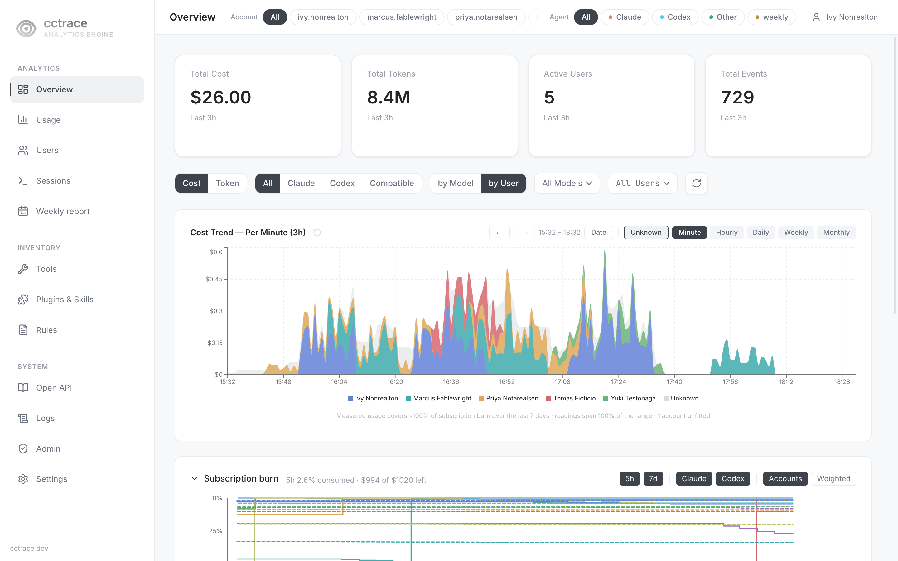{ loading=lazy }

카드 아래:

- 필터 바: **Cost**/**Token** 보기, 모델 카테고리(**All**/**Claude**/**Codex**/**Compatible**), **by Model**/**by User** 묶기, 모델·사용자 드롭다운 필터
- **Cost Trend**: **Minute**·**Hourly** 단위에서는 쌓아 그리는 영역 차트, **Daily**·**Weekly**·**Monthly** 단위에서는 버킷당 막대 하나로 쌓는 막대 차트. **Date**는 임의의 since/until 범위를 여는 버튼이다. **Unknown**은 대시보드가 직접 측정하지 못한 구독 소비분을 쌓아 보이는 토글이다 — 제공자 자체 사용량 계측과 OTEL/JSONL로 수집된 값의 차이에서 추정한 값으로, 특정 사용자·모델에 귀속되지 않으며, 범위가 그 추정을 뒷받침하지 못할 때(예: 프로젝트·사용자·모델·에이전트 필터가 걸려 있을 때)는 비활성화된다. 차트의 한 지점을 선택하면 아래 카드·패널이 그 지점의 범위로 좁혀진다. 각주는 이 범위의 구독 소비분 중 측정할 수 있었던 비율을 적는다. 예: "Measured usage covers ≈100% of subscription burn over the last 7 days · readings span 100% of the range". 마우스를 올리면 방법과, 해당될 때는 계정별 적합도 표시.
- **Subscription burn**(접을 수 있음; 접혀 있을 때 "preview" 표시): 연결된 Claude/Codex 구독 각각의 쿼터 창 소비량을 계정별로 보여준다. **5h**/**7d** 창과 **Claude**/**Codex** 제공자를 토글하고, **Accounts**는 청구 계정별로 선 하나씩, **Weighted**는 가격 가중 평균을 더한다(가격이 매겨진 계정이 둘 이상일 때만 나타남). 축은 반전되어 있다 — 위가 0%, 아래가 100% 소진이므로 선의 높이가 그 창에 남은 양이고, 창이 초기화되면 선이 다시 위로 뛴다. 헤드라인은 "\<창\> X% consumed · $Y of $Z left" 형식이고, 하단 각주는 가중 평균에 반영된 월 구독료 합과 제외된 계정(가격 미설정이거나 범위 내 측정값이 없는 계정) 표기.

    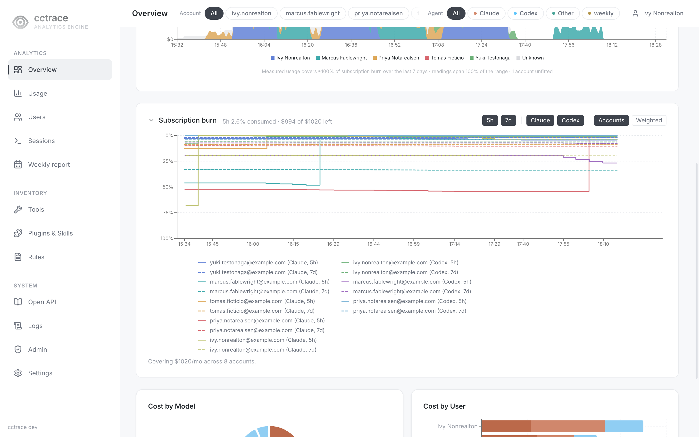{ loading=lazy }

Cost Trend는 이미 **Daily**부터 영역에서 막대로 바뀌어 **Weekly**·**Monthly**까지 막대로 유지된다. Subscription burn은 **Weekly**나 **Monthly**에 이르러서야 계단선에서 버킷당 막대 하나(시간 가중 평균)로 바뀐다 — 쿼터 초기화가 그만큼 잦은 구간에서는 계단선이 읽을 수 없는 해칭으로 뭉개지기 때문이다.

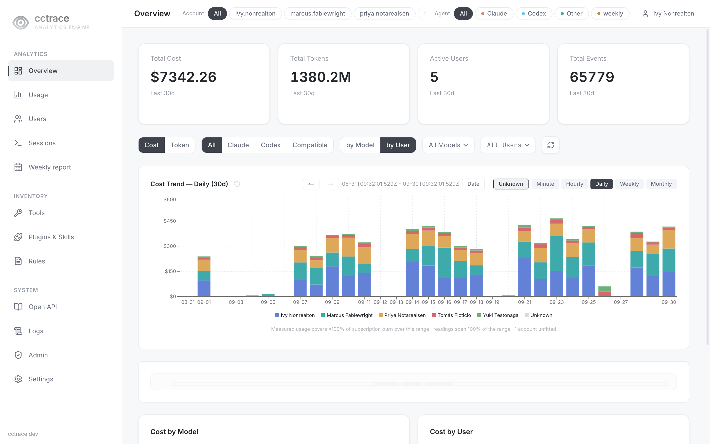{ loading=lazy }

- **Cost by Model**, **Cost by User**: 같은 범위 합계를 파이 차트와 누적 막대로, 각각 다른 각도에서 표시.

## Usage (`/cost`) {#usage-cost}

Overview와 같은 **Cost Trend** 차트 아래에 사용자·모델별 전체 내역 표가 이어진다: **Requests**, **Input Tokens**, **Output Tokens**, **Cost**(Token 보기에서는 **Total Tokens**), 비용 순 정렬, 하단에 합계 행. 검색창은 사용자나 모델로 표를 거른다.

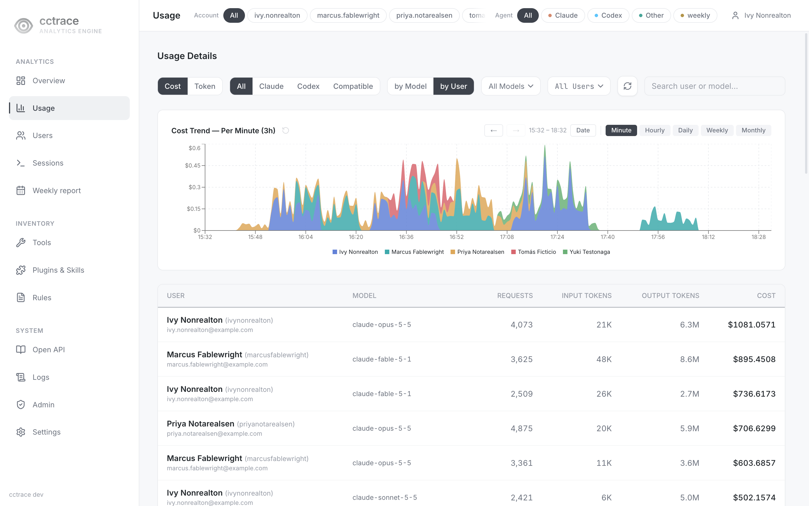{ loading=lazy }

소유자가 없고 **weekly**로 표시되는 행은 사람이 아니라 서버 자체 Codex 계정이 [주간 AI 리포트](#weekly-report-weekly)를 만드는 데 쓴 토큰이다. 마우스를 올리면 설명이 나온다.

## Users (`/users`) {#users-users}

**Analytics** 탭은 사용자를 비용 순으로 나열한다. 사람 카드를 선택하면 바로 옆에 인라인 Detail View가 열린다. 관리자에게는 **Management** 탭이 추가되며, 이 탭은 [사용자](users.md)에서 설명한다.

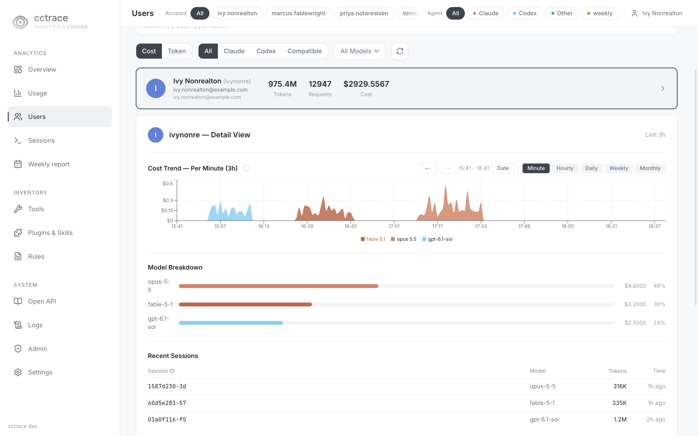{ loading=lazy }

## Sessions (`/sessions`) {#sessions-sessions}

왼쪽에 세션 목록, 오른쪽에 선택한 세션의 트랜스크립트.

- 목록에서 세션을 선택하면 트랜스크립트가 열림. 스크롤하면 더 불러오고 조건에 맞는 세션 수와 전체 수를 표시
- **Assembled**: 관련 세션 파일(서브에이전트, 분기)을 한 대화로 합침. **Raw**: 파일별 레코드를 그대로, 파일 단위로 묶어 표시
- **Interactive**(기본값): 사람의 입력이 있는 세션. **Headless**: `claude -p` 같은 기계 구동 세션. **All**: 둘 다
- 프로젝트 선택기로 한 프로젝트만 표시. 검색창은 불러온 세션을 세션, 사용자, 프로젝트로 거름

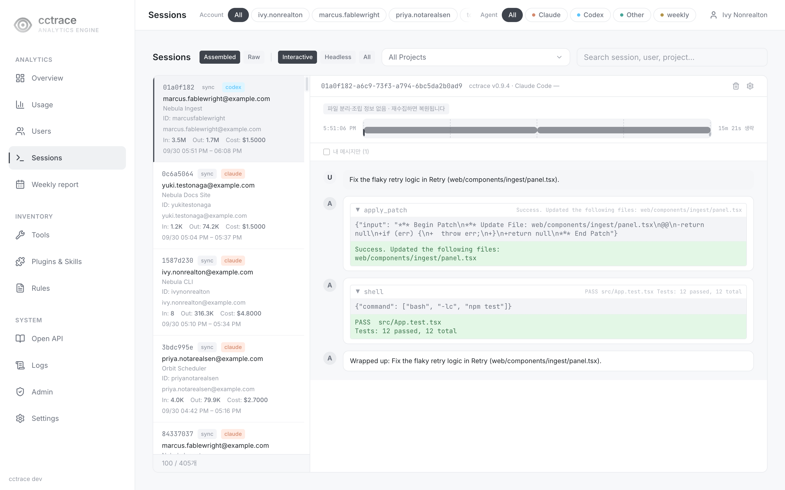{ loading=lazy }

트랜스크립트의 도구 호출은 기록한 에이전트가 실제로 보낸 형태 그대로 렌더링된다: Claude 세션의 `Read`/`Edit`/`Bash` 단계 —

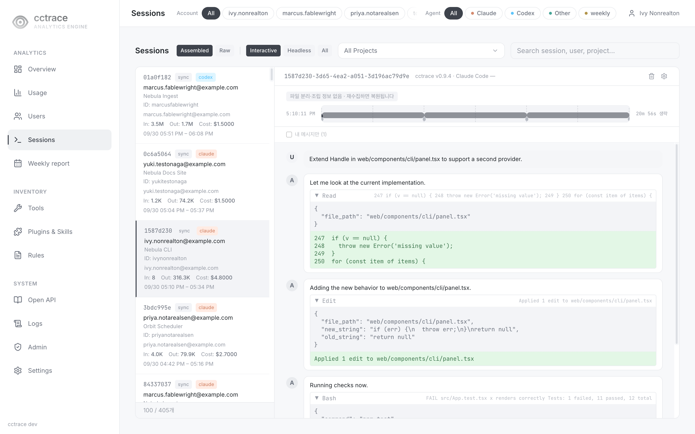{ loading=lazy }

— 그리고 **Agent** 선택기를 Codex로 좁혀서 본 `codex` 태그 세션의 `apply_patch`/`shell` 단계:

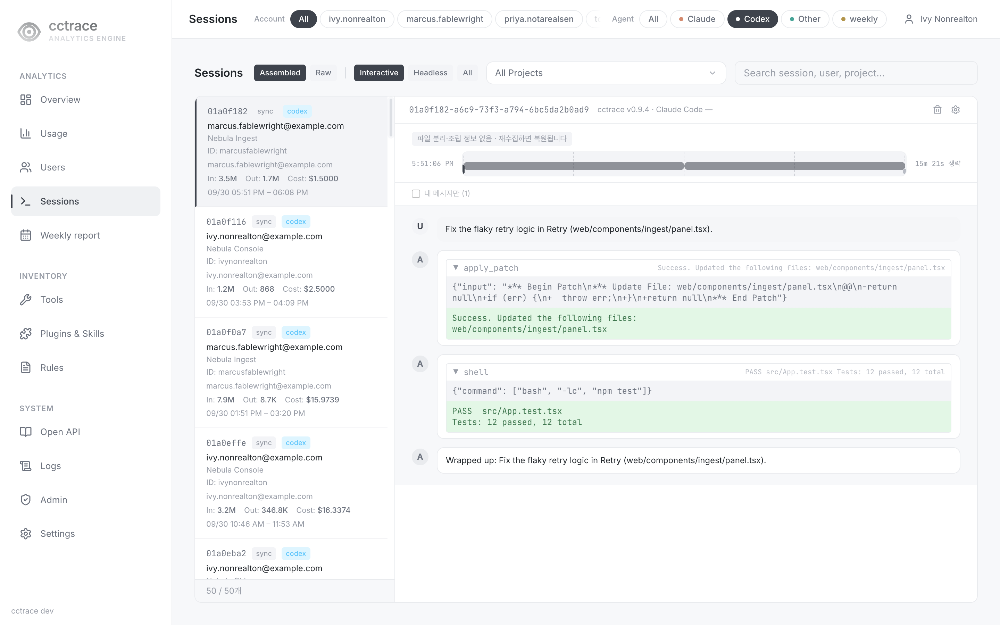{ loading=lazy }

### 세션 삭제 {#delete-a-session}

트랜스크립트 헤더의 휴지통 아이콘(툴팁 `세션 삭제`)은 세션 레코드와 거기 딸린 이벤트·메트릭을 삭제한다. 되돌릴 수 없고 클라이언트가 같은 세션을 다시 올려도 서버가 거부한다.

| 역할 | 삭제 범위 |
|---|---|
| `admin` | 모든 세션. 이어서 프로젝트의 다른 세션 삭제와 프로젝트 수집 중단을 묻는 대화상자 표시 |
| `user` | 본인 세션. 소유자 삭제 정책이 허용할 때(기본값 허용) |

관리자는 휴지통 옆 톱니 대화상자(`세션 수집 설정`)에서 소유자 삭제 정책을 정하고 차단 목록의 프로젝트를 해제한다. 프로젝트 선택기에서 프로젝트 전체를 삭제할 수도 있다.

### `user` 계정 본인의 세션 {#a-user-accounts-own-sessions}

`user` 계정의 `/sessions`도 같은 목록·트랜스크립트 페이지이며, 본인 세션으로만 좁혀지고 계정 선택기와 사이드바의 **Admin** 항목이 없다:

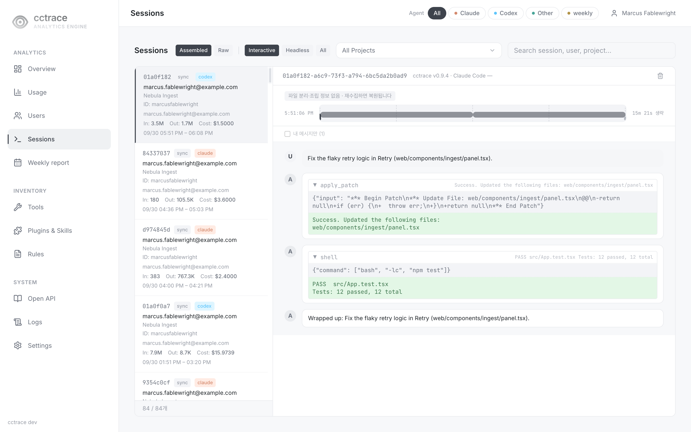{ loading=lazy }

## Weekly report (`/weekly`) {#weekly-report-weekly}

로그인한 계정 본인의 한 주 기록. 제목 옆 화살표로 주를 이동하며, 진행 중인 주는 표시가 붙고 아직 시작하지 않은 주는 열 수 없다.

제목 아래 요약 줄은 그 주의 세션을 에이전트별로, 그리고 규칙으로 산출한 "작업 구간" 수를 센다(`Claude Code 세션 N · Codex 세션 N · 작업 구간 N`). 해당하는 경우 그 주의 유의사항도 함께 붙는다 — [Tools](#tools-tools) 페이지의 Codex 도구 수와 같은 OTEL 메트릭 범위 안내, 분석에서 제외된 관리자 기록 건수, 작업 구간 사실이 덮지 못한 세션 수 등.

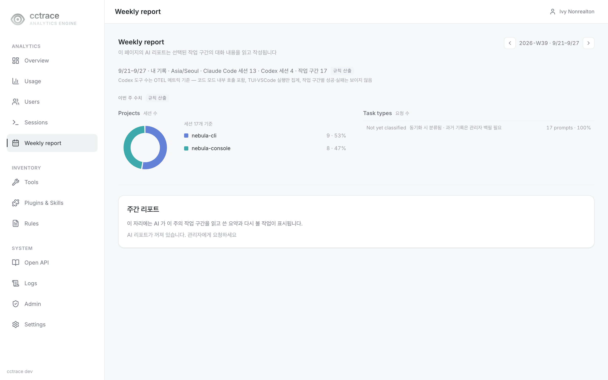{ loading=lazy }

- **Projects**: 그 주 세션을 프로젝트별로 나눈 도넛 차트
- **Task types**: 그 주의 턴을 작업 유형별로 묶은 목록. 유형을 선택하면 해당 작업 구간이 열림. 분류를 아직 돌리지 않은 데이터셋은 모든 턴을 **Not yet classified**로 표시
- **AI 리포트**: 그 주 작업 구간의 대화 내용을 읽어 작성하는 요약과 다시 볼 작업 목록 — 기본값은 꺼짐, 관리자가 켤 때까지 "AI 리포트가 꺼져 있습니다" 표시

## Tools (`/tools`) {#tools-tools}

최근 30일간 Claude Code·Codex 도구 호출: 총 사용 수, 성공, 실패, 전체 성공률, 그리고 도구별 표와 성공률 막대.

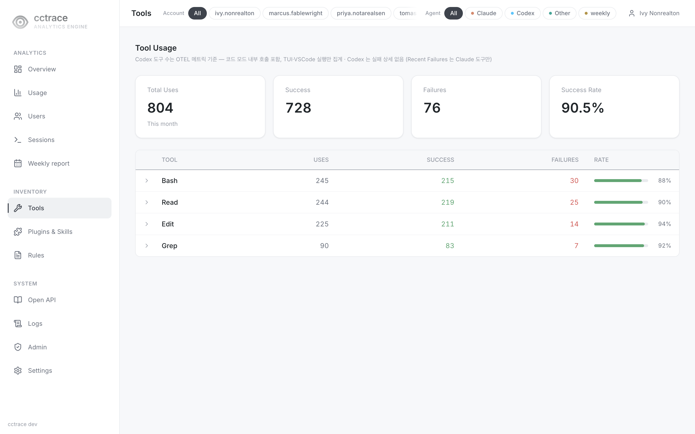{ loading=lazy }

제목 아래 범위 안내는 Codex 수치의 근거를 적는다: Codex의 도구 수는 codex.tool.call OTEL 메트릭 기준이라 코드 모드 내부 호출을 포함하고 TUI·VS Code 실행만 집계되며, Codex는 호출 단위 실패 상세도 없어 도구를 펼쳤을 때 보이는 **Recent Failures** 목록은 Claude 도구만 담는다.

## Plugins & Skills (`/plugins`) {#plugins-skills-plugins}

Claude Code 슬래시 명령·스킬 호출과 Codex 스킬 주입을 플러그인 또는 스킬 이름별로 묶어 표시.

- 기간: **7d**, **30d**(기본값), **90d**, **All**
- 요약 카드: **Claude Calls**, **Codex Calls**, **Avg Tokens**, **Total**, **Input**, **Output** 토큰
- 보기: **By Skill**, **By User**, **By Project**. **By Project**는 git 저장소 안의 세션만 집계

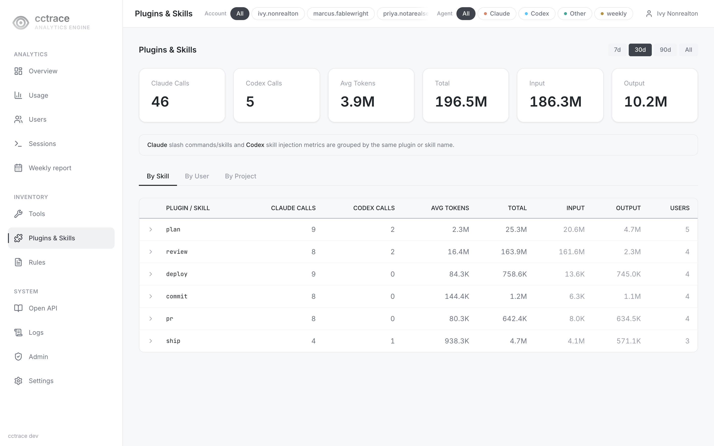{ loading=lazy }

`/skills`는 이 페이지로 이동.

## Rules (`/rules`) {#rules-rules}

세션이 실행된 git 저장소에서 클라이언트가 찾은 CLAUDE.md와 AGENTS.md 파일, 그리고 버전 이력.

- 텍스트, 상태(**Active**, **Missing**), 저장소로 필터. 요약 카드는 **Repositories**와 **Rule Files** 수
- 파일을 선택하면 버전별 내용 확인과 댓글 작성 가능
- `user` 계정은 본인 세션이 있는 저장소의 규칙 파일만 조회

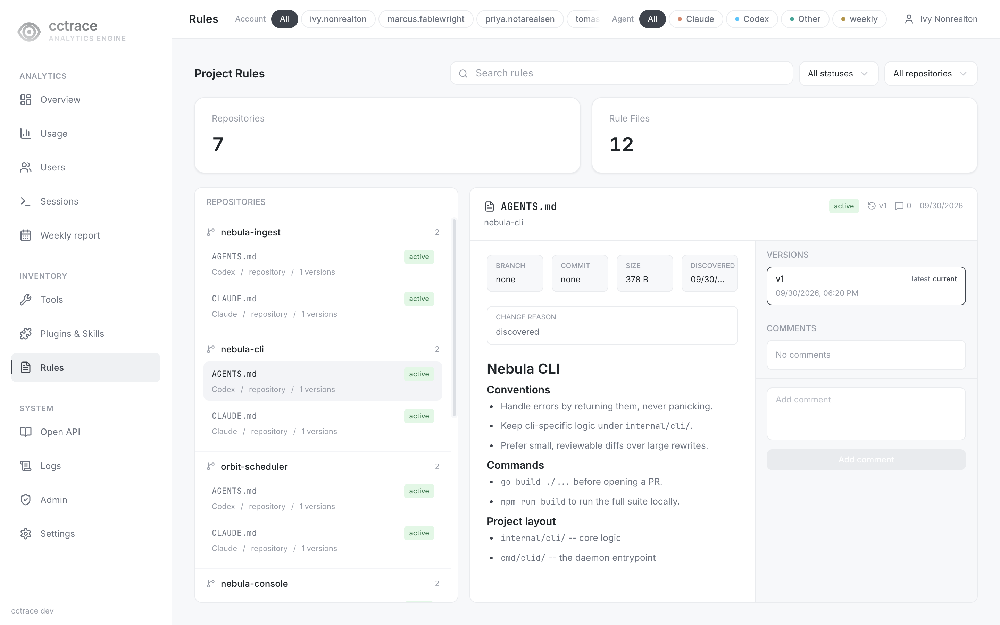{ loading=lazy }

## Logs (`/logs`) {#logs-logs}

최근 30일 원시 텔레메트리, 페이지당 50행.

| 탭 | 열 |
|---|---|
| Events | Time, Event, Model, Session, User, Input, Output, Cost, Age |
| Metrics | Time, Metric, Model, User, Value, Session, Age |

Logs는 본인 데이터로 제한되지 않는다. 프롬프트나 도구 출력처럼 자유 텍스트를 담은 속성은 페이지로 오기 전에 제거된다.

## Admin (`/admin`) {#admin-admin}

관리자에게만 보임.

| 탭 | 내용 |
|---|---|
| **Clients** | 버전을 보고한 클라이언트별 Profile Email, Name, User ID, Client Version, Last Seen, Status |
| **Storage** | 보존 기간, 테이블 크기, 데이터 볼륨 여유 공간. 보존 기간은 여기서 수정. [운영](../server/operations.md#data-retention) 참고 |

`/versions`와 `/storage`는 `/admin`으로 이동.

**Excluded Accounts**, **Unpriced Models**, **Insights**, **AI** 탭은 변경이 진행 중이라 이 문서에서 다루지 않음.

## Settings (`/settings`) {#settings-settings}

- **Change Password**: 현재 비밀번호와 8자 이상의 새 비밀번호 입력. 임시 비밀번호 계정은 변경할 때까지 이 페이지로 이동
- **Appearance**: 강조 색, 에이전트 색조, 로고 마크 표시 여부

API 토큰과 결제 계정 섹션은 변경이 진행 중이라 이 문서에서 다루지 않음.

## 변경이 진행 중인 페이지 {#pages-under-active-development}

다음 페이지는 존재하지만 변경이 진행 중이라 이 문서에서 다루지 않음.

| 페이지 | 사이드바 항목 |
|---|---|
| `/open-api` | Open API |
