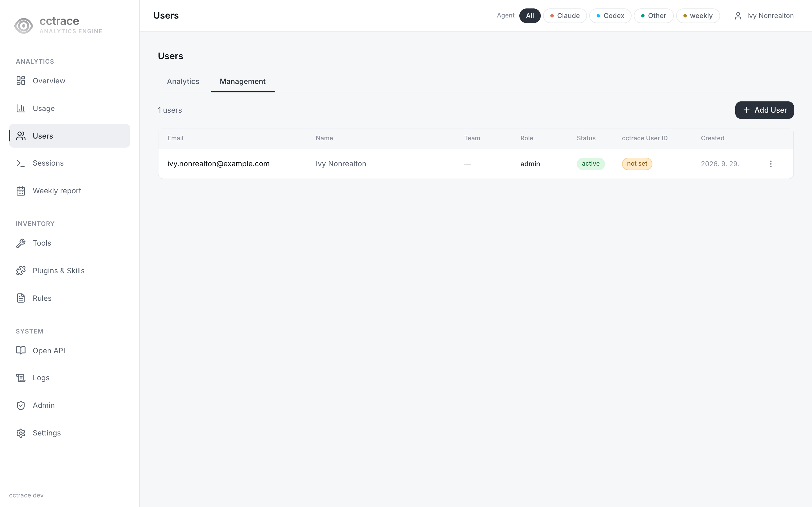
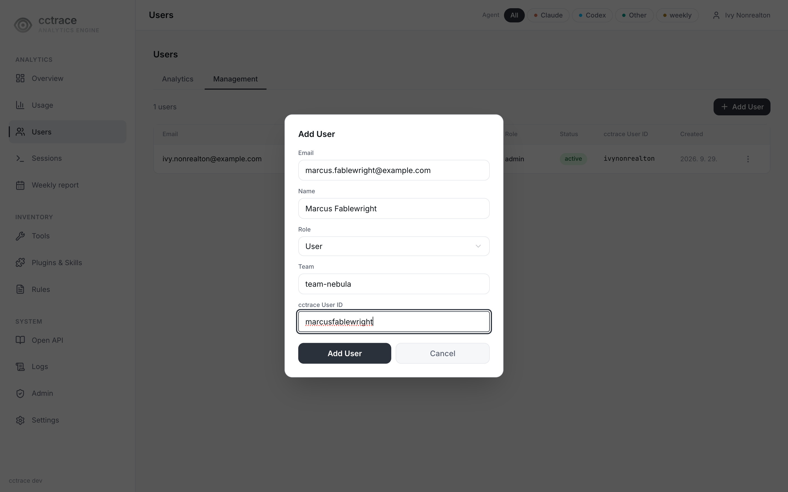
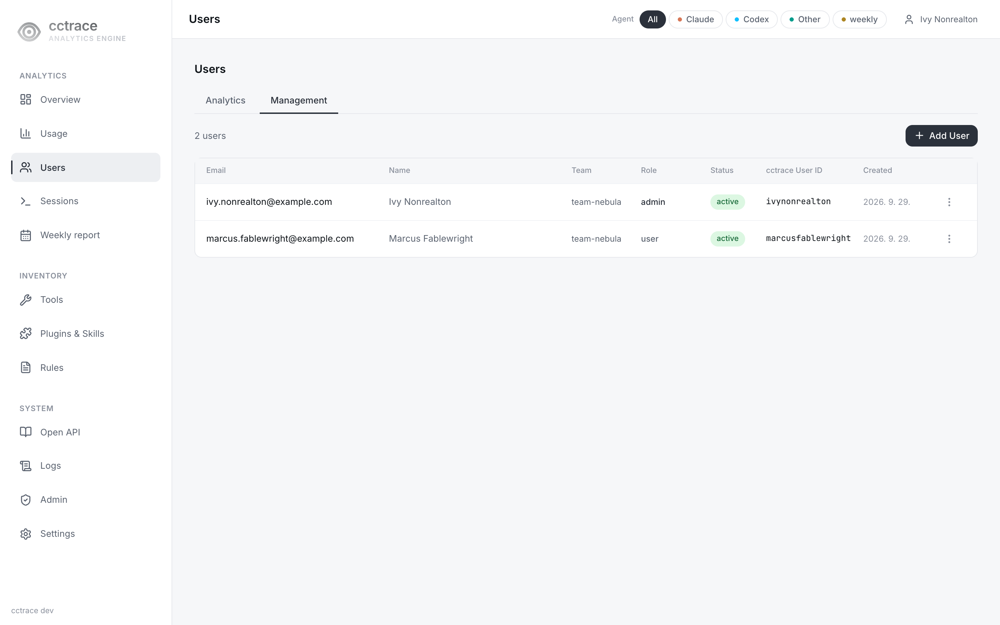
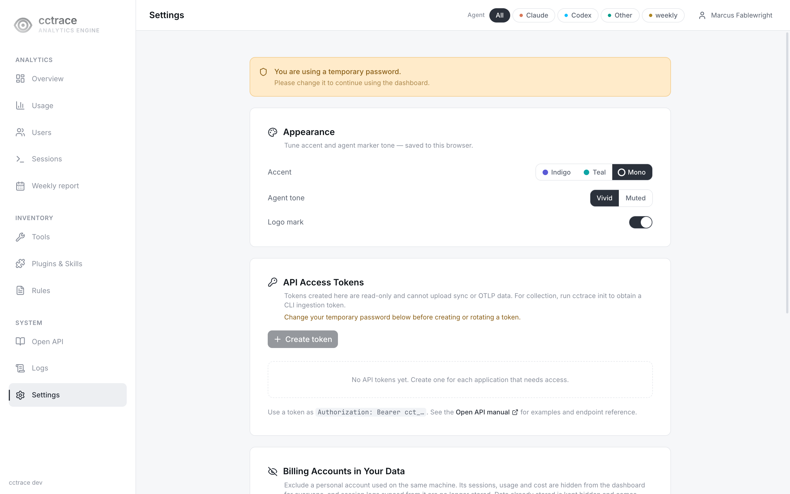
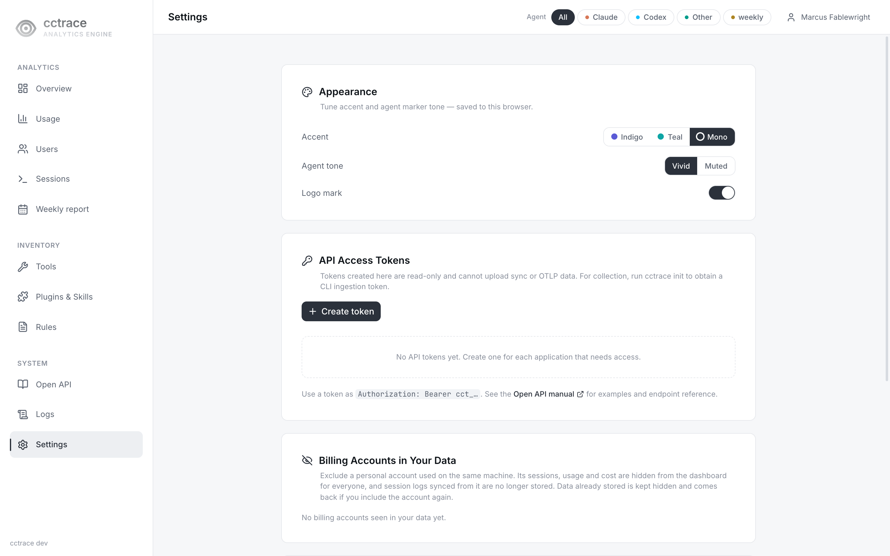
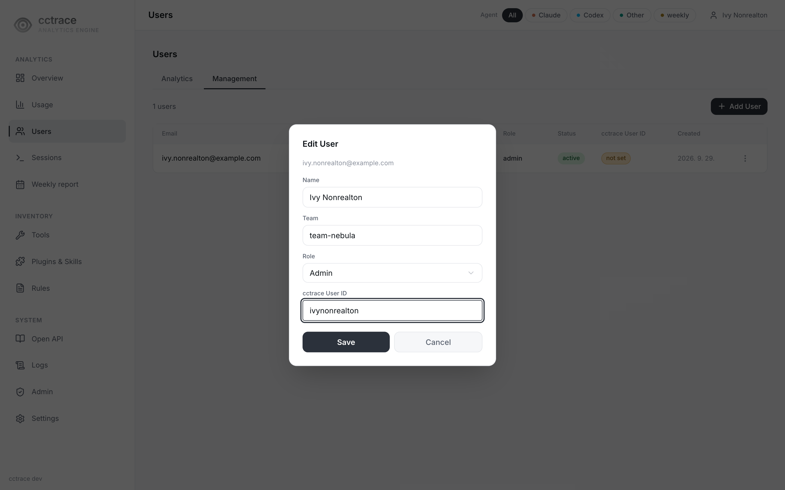

# Users

Administrators create one dashboard account per person. The account's cctrace user ID is what ties the data a client sends to that person.

## Roles

| Role | Sees and does |
|---|---|
| `admin` | Every user's sessions, the **Management** tab on `/users`, the `/admin` page, project deletion |
| `user` | Their own sessions; the aggregates every signed-in user shares |

What each role can read is detailed in [Privacy](../reference/privacy.md#who-can-see-what).

## Add a user

1. Open **Users** (`/users`) and select the **Management** tab. Only administrators see it.

    { loading=lazy }

2. Select **Add User** and fill in every field. The server rejects the request if any is empty.

    | Field | Value |
    |---|---|
    | Email | The person's sign-in address, for example `alice@example.com` |
    | Name | Display name |
    | Role | `User` or `Admin` |
    | Team | Team name. `cctrace init` fails if the account has no team. The admin created at `/setup` has no team until one is set with **Edit**. |
    | cctrace User ID | A short identifier, for example `alice`. The person enters it in `cctrace init`. The field suggests user IDs already seen in received telemetry. |

    { loading=lazy }

3. The dialog shows a **Temporary Password** once. Give it to the person together with the cctrace user ID.

    { loading=lazy }

| Error | Cause |
|---|---|
| `email already exists` | Another account has this email |
| `cctrace_user_id already assigned to another user` | Another account has this user ID |

## First sign-in of a new user

1. The person signs in at `/login` with the email and the temporary password.
2. Until the password is changed, the dashboard sends every page to `/settings` and the other navigation entries are disabled.

    { loading=lazy }

3. The person sets a new password (at least 8 characters) under **Change Password**.

    { loading=lazy }

The server refuses `cctrace init` authentication while a temporary password is pending; `init` stops with `please change your password on the dashboard before authenticating`. After the change, continue with [Connect](../client/setup.md).

## How data is attributed to an account

- `cctrace init` authenticates with the cctrace user ID and password. The server returns the account's name, email, and team, and an upload token. The client stores them in its profile.
- Every session upload carries the profile's user ID and email.
- The OTEL environment that `init` writes labels telemetry with the user ID, name, email, and team through `OTEL_RESOURCE_ATTRIBUTES` (`user.id=<id>,user.name=<name>,user.profile.email=<email>,user.team=<team>`). When telemetry arrives with a user's upload token, the server attributes it to the account that owns the token.
- The dashboard shows a `user` account the data stored under its cctrace user ID. An account without one (the **not set** badge in the list) sees no session data (with the default `CCTRACE_USERID_ACCESS_CONTROL`).
- Changing an account's cctrace user ID does not move data already stored under the old ID.

## Manage accounts

Open the row menu on the **Management** tab.

| Action | Effect |
|---|---|
| **Edit** | Change name, team, role, or cctrace user ID. A team that is set cannot be emptied: **Save** is disabled with `Team is required.` |
| **Deactivate** / **Activate** | A deactivated account cannot sign in (`account is disabled`), cannot authenticate `cctrace init`, and its upload token is refused, so its clients stop sending data. Stored data is kept. |
| **Reset Password** | Issues a new temporary password, shown once. At the next sign-in the person must change it again, and `cctrace init` is refused until then. Collection with the existing upload token continues. |
| **Revoke API Token** | Shown when the account has a token. Deletes all of the account's tokens, including the upload token. The person's clients stop sending data until they run `cctrace init` again. |
| **Clear Collected Data** | Deletes the telemetry and session records stored under the account's email. This cannot be undone. |

{ loading=lazy }

There is no action that deletes an account; deactivate it instead.

Role and deactivation changes reach an open browser session within 15 minutes: the dashboard's access cookie lasts 15 minutes, and renewing it reads the account again.

## Analytics tab

The **Analytics** tab of `/users`, visible to every signed-in user, lists users ordered by cost. The cost figures are under active development and are not documented here.
