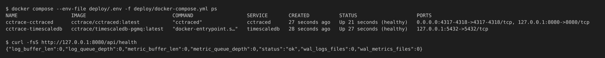
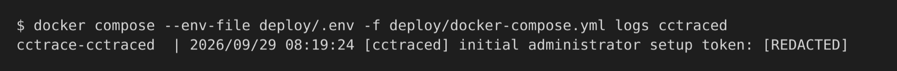

# 서버 설치

이 저장소에서 서버 이미지 두 개를 빌드하고 서버 env 파일을 작성한 뒤 Docker Compose로 스택을 올리는 절차.

스택은 컨테이너 두 개로 구성된다. `cctraced`(OTLP 수집, 동기화 API, 대시보드)와 TimescaleDB다. 두 이미지 모두 레지스트리에 게시되지 않는 로컬 빌드 태그이고 compose 파일이 `pull_policy: never`를 지정하므로, 두 이미지를 먼저 빌드하지 않으면 스택이 시작되지 않는다.

<div class="diagram">
--8<-- "server-deployment.ko.svg"
</div>

## 요구 사항

- Compose 플러그인이 포함된 Docker
- 이 저장소의 클론. 아래 모든 명령은 저장소 루트에서 실행

## 1. 이미지 빌드

```console
$ docker build -t cctrace/timescaledb-pgmq:latest docker/timescaledb-pgmq/
$ docker build -f deploy/Dockerfile --build-arg UPDATE_SIGNING=optional \
    -t cctrace/cctraced:latest .
```

- 첫 번째 이미지: pgmq 확장을 포함한 TimescaleDB
- 두 번째 이미지: Docker 안에서 대시보드와 `cctraced` 바이너리를 빌드. `UPDATE_SIGNING=optional`은 업데이트 서명 키 없이 빌드. 기본값 `required`는 키가 없으면 실패
- 서버 env 파일에 `IMAGE_TAG` 또는 `DB_IMAGE_TAG`를 지정했다면 정확히 같은 태그로 빌드(`cctrace/cctraced:<IMAGE_TAG>`, `cctrace/timescaledb-pgmq:<DB_IMAGE_TAG>`). Compose는 레지스트리로 대체하지 않음

## 2. 서버 env 파일 작성

Compose는 `deploy/` 디렉터리의 `.env`(서버 env 파일)에서 설정을 읽는다. 예제 파일을 복사한 뒤 아래 3개 키만 고친다. 나머지 키는 기본값과 설명 주석 그대로 둔다.

```console
$ cp deploy/.env.example deploy/.env
```

| 키 | 필수인 이유 |
|----|-------------|
| `JWT_SECRET` | 그대로 둘 기본값 없음. 없으면 Compose가 시작 거부, 32바이트 미만이면 `cctraced` 종료. `openssl rand -hex 32`로 생성 |
| `LOGS_DIR` | 기본값 없음. 없으면 Compose가 시작 거부. 컨테이너의 `/data/logs`에 마운트되는 호스트 디렉터리. 미리 생성 권장 |
| `DB_PASSWORD` | `change-me-strong-password` 자리 표시 값이 기본값이며 그대로 두면 안 됨. `openssl rand -hex 20`으로 생성 |

`deploy/.env`의 3개 키는 에디터로 고치거나, 명령줄에서 바로 바꾼다.

```console
$ jwt_secret=$(openssl rand -hex 32) && sed -i.bak "s|^JWT_SECRET=.*|JWT_SECRET=${jwt_secret}|" deploy/.env
$ db_password=$(openssl rand -hex 20) && sed -i.bak "s|^DB_PASSWORD=.*|DB_PASSWORD=${db_password}|" deploy/.env
$ LOGS_DIR=/absolute/path/on/the/host/for/logs && mkdir -p "$LOGS_DIR" && sed -i.bak "s|^LOGS_DIR=.*|LOGS_DIR=${LOGS_DIR}|" deploy/.env
$ rm deploy/.env.bak
```

!!! warning "`DB_PASSWORD`는 첫 시작 전에 결정"
    PostgreSQL은 데이터 볼륨을 처음 초기화할 때만 비밀번호를 적용한다. 이후 `DB_PASSWORD`를 바꾸면 DB 역할은 옛 비밀번호로 남고 `cctraced`는 `password authentication failed`로 재시작을 반복한다. 복구하려면 DB 볼륨을 지워야 하는데 그러면 수집한 데이터가 모두 삭제된다.

`DB_APP_CREDENTIALS`는 비워 둔다. 이유는 [설정](configuration.md#database) 참조.

## 3. 노출 범위 확인

첫 시작 전에 각 포트가 어느 인터페이스에 바인드될지 정한다.

| 포트 | 기본 호스트 바인드 | 용도 |
|------|-------------------|------|
| 8080 | 127.0.0.1 | 대시보드와 REST API(클라이언트 동기화 포함) |
| 4317 | 0.0.0.0(모든 인터페이스) | OTLP over gRPC |
| 4318 | 0.0.0.0(모든 인터페이스) | OTLP over HTTP |
| 5432 | 127.0.0.1(고정) | TimescaleDB |

!!! warning "OTLP는 TLS 없이 모든 인터페이스에서 수신"
    4317과 4318 포트는 다른 머신의 텔레메트리를 받는다. `cctraced`는 TLS를 종료하지 않는다. 통제하지 않는 네트워크라면 서버 env 파일에서 `GRPC_BIND`와 `OTEL_HTTP_BIND`를 루프백이나 사설 주소로 지정하거나, 방화벽·VPN으로 포트를 제한하거나, [HTTPS 오버레이](#optional-https-with-caddy)를 쓴다.

대시보드는 기본적으로 루프백에 바인드된다. 클라이언트 머신이 동기화하려면 8080 포트에 닿아야 하므로 `HTTP_BIND`를 도달 가능한 주소로 지정하거나 TLS를 종료하는 프록시를 앞에 둔다. 전체 포트 표는 [포트](../reference/ports.md) 참조.

## 4. 스택 시작

```console
$ docker compose --env-file deploy/.env -f deploy/docker-compose.yml up -d
```

`up -d`가 정상 종료했다는 것은 컨테이너가 생성됐다는 뜻일 뿐 서버가 시작됐다는 뜻은 아니다. `cctraced`의 설정 오류는 자체 로그에만 나온다.

## 5. 확인

```console
$ docker compose --env-file deploy/.env -f deploy/docker-compose.yml ps
$ curl -fsS http://127.0.0.1:8080/api/health
```

{ loading=lazy }

- 두 컨테이너 모두 `Up`과 `(healthy)` 표시가 정상. `cctraced` 헬스 체크는 `/api/version`을 확인하며 시작 유예가 30초라 처음에는 `health: starting` 표시
- `/api/health` 응답: DB에 연결되면 `"status":"ok"`, 연결되지 않으면 HTTP 503과 `"status":"unhealthy"`
- `cctraced`가 `Restarting`이면 로그 확인:

```console
$ docker compose --env-file deploy/.env -f deploy/docker-compose.yml logs cctraced
```

## 6. 첫 관리자 생성

사용자가 없는 DB에서는 `cctraced`가 로그에 일회용 설정 토큰을 출력한다.

```text
[cctraced] initial administrator setup token: <token>
```

{ loading=lazy }

토큰을 직접 정하려면 첫 시작 전에 서버 env 파일에 `CCTRACE_SETUP_TOKEN`을 지정한다. 첫 관리자가 생성되면 토큰은 무효가 된다. 이어서 [첫 관리자](../dashboard/first-admin.md)로 진행한다.

## 선택: Caddy로 HTTPS 적용 {#optional-https-with-caddy}

`deploy/docker-compose.tls.yml`은 Caddy 컨테이너를 추가하는 선택형 오버레이다. Caddy가 세 리스너 모두의 TLS를 종료하고 `deploy/caddy/Caddyfile`에 따라 compose 네트워크를 통해 `cctraced`로 전달한다. 기본 compose 파일은 그대로이며 Caddy 이미지(`caddy:2-alpine`)는 Docker Hub에서 받는다.

1. 서버 env 파일에서 평문 포트를 루프백으로 옮기고 서버 이름 지정:

    ```text
    HTTP_BIND=127.0.0.1
    GRPC_BIND=127.0.0.1
    OTEL_HTTP_BIND=127.0.0.1
    CADDY_SITE_ADDRESS=cctrace.company.example
    ```

    `CADDY_SITE_ADDRESS`는 오버레이 필수값이며 호스트 이름이나 서버 IP 주소 모두 가능. 바인드 설정 세 개를 빼면 평문 포트가 TLS 포트 옆에서 계속 열려 있음.

2. compose 파일 두 개로 시작:

    ```console
    $ docker compose --env-file deploy/.env \
        -f deploy/docker-compose.yml -f deploy/docker-compose.tls.yml up -d
    ```

| 채널 | 평문(컨테이너) | TLS(호스트 기본값) |
|------|----------------|--------------------|
| 대시보드와 REST API | 8080 | 8443 |
| OTLP gRPC | 4317 | 5317 |
| OTLP HTTP | 4318 | 5318 |

이후 클라이언트는 대시보드와 동기화에 `https://cctrace.company.example:8443`, OTLP에 5317 또는 5318 포트를 사용한다.

Codex 메트릭은 이 오버레이를 거쳐서는 서버에 도달하지 않는다. cctrace는 프로필의 OTEL 엔드포인트에서 포트 4317만 4318로 바꿔 Codex 메트릭 엔드포인트를 만든다. 따라서 OTEL 엔드포인트가 5317이면 Codex의 OTLP/HTTP가 5317로 가고 Caddy는 이를 gRPC 리스너로 전달한다. [Codex CLI](../agents/codex.md) 참조.

### 인증서

`CADDY_TLS_MODE` 기본값은 `internal`이다. Caddy가 자체 CA로 인증서를 발급하므로 공개 DNS가 필요 없고 IP 주소만으로도 동작한다. 클라이언트는 이 CA를 신뢰해야 한다. CA 내보내기:

```console
$ docker compose --env-file deploy/.env \
    -f deploy/docker-compose.yml -f deploy/docker-compose.tls.yml \
    exec caddy cat /data/caddy/pki/authorities/local/root.crt > cctrace-ca.crt
```

Caddyfile에 적힌 에이전트별 CA 지정 변수:

| 에이전트 | 변수 |
|----------|------|
| Claude Code, gRPC exporter | `OTEL_EXPORTER_OTLP_CERTIFICATE` |
| Claude Code, HTTP exporter | `NODE_EXTRA_CA_CERTS` |
| Codex | `SSL_CERT_FILE` |

`SSL_CERT_FILE`은 신뢰 저장소에 추가하는 것이 아니라 대체한다. CA를 시스템 루트 인증서와 이어 붙이지 않으면 Codex가 자체 API 엔드포인트를 검증하지 못한다.

이름이 공개 DNS로 해석되고 인터넷에서 80 포트에 닿을 수 있다면 `CADDY_TLS_MODE=acme`로 지정한다. Caddy가 공개적으로 신뢰되는 인증서를 받으므로 클라이언트 쪽 CA 설정이 필요 없다.

!!! warning "`caddy_data` 볼륨 유지"
    발급한 인증서와 내부 CA가 이 볼륨에 있다. 지우면 새 CA가 만들어지고 이전 CA를 신뢰하던 클라이언트는 모두 연결이 끊긴다.

## 다음 단계

- [설정](configuration.md): 서버 env 파일의 모든 설정
- [운영](operations.md): 로그, 백업, 업그레이드, 보존 기간
